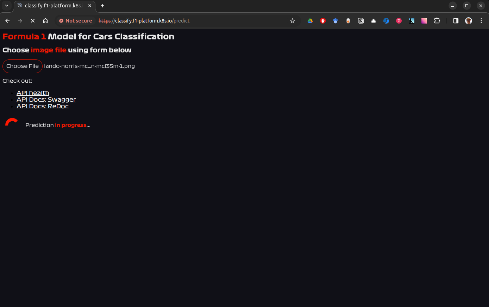

# formula-one-image-classification-model
Repository holds code and data for image classification model - of cars representing particular teams in Formula 1.

# Repository structure
- `/assets`: place for code to be imported as modules later-on,
- `/input`: data for model training, validation and testing are stored here. The amount of images commited is an example - I reduced their number to lessen the amount of storage held in GitHub/GitLab,
- `/logs`: place for logs created during model training,
- `/models`: space for binary model file (h5 format),
- `/requirements`: place for files with package requirements to be installed with specific system libraries,
- `/static`: space for files to be served on a webpage with `uvicorn` framework,
- `/templates`: place for website templates to be later-on rendered and served inside an app,
- `formula-one-image-classification.ipynb`: improved / fixed jupyter notebook explaining model training process (once again, by [faw](https://github.com/faw01)),
- `main.py`: Python file with API implementation and endpoints created with `FastAPI` framework,
- `README.md`: `Markdown`-based file you are currently reading,
- `requirements.txt`: file with minimum package requirements necessary for API to work properly,
- `environment.yaml`: file with full package requirements, necessary for above-mentioned `jupyter notebook` to work without errors.

# Docker image
## Building
```
docker build --no-cache \
--build-arg MINIO_URL="<change_me>" \
--build-arg MINIO_ACCESS_KEY="<change_me>" \
--build-arg MINIO_SECRET_KEY="<change_me>" \
--build-arg DEBUGGING_LOCAL="<change_me>" \
-t f1-image-classification-model:v0.9 -f Dockerfile .
```

## Running
```
docker run -it \
-e MINIO_URL="<change_me>" \
-e MINIO_ACCESS_KEY="<change_me>" \
-e MINIO_SECRET_KEY="<change_me>" \
-e DEBUGGING_LOCAL="<change_me>" \
f1-image-classification-model:v0.9
```

# Adding image to use in minikube
`minikube image load f1-image-classification-model:v0.9`

# Example
## Homepage

## Predict page

## Image


## Response output
```
{
    "prediction": {
        "class": "mclaren",
        "confidence_percent": 99.96,
        "message": "1st Prediction: mclaren with 99.96% confidence.",
    },
    "predictions": {
        1: {
            "class": "mclaren",
            "confidence_percent": 99.96,
            "message": "1st Prediction: mclaren with 99.96% confidence.",
        },
        2: {
            "class": "bwt",
            "confidence_percent": 0.04,
            "message": "2nd Prediction: bwt with 0.04% confidence.",
        },
        3: {
            "class": "toro_rosso",
            "confidence_percent": 0.0,
            "message": "3rd Prediction: toro_rosso with 0.00% confidence.",
        },
        4: {
            "class": "williams",
            "confidence_percent": 0.0,
            "message": "4th Prediction: williams with 0.00% confidence.",
        },
        5: {
            "class": "mercedes",
            "confidence_percent": 0.0,
            "message": "5th Prediction: mercedes with 0.00% confidence.",
        },
        6: {
            "class": "haas",
            "confidence_percent": 0.0,
            "message": "6th Prediction: haas with 0.00% confidence.",
        },
        7: {
            "class": "redbull",
            "confidence_percent": 0.0,
            "message": "7th Prediction: redbull with 0.00% confidence.",
        },
        8: {
            "class": "alfa_romeo",
            "confidence_percent": 0.0,
            "message": "8th Prediction: alfa_romeo with 0.00% confidence.",
        },
        9: {
            "class": "ferrari",
            "confidence_percent": 0.0,
            "message": "9th Prediction: ferrari with 0.00% confidence.",
        },
        10: {
            "class": "renault",
            "confidence_percent": 0.0,
            "message": "10th Prediction: renault with 0.00% confidence.",
        },
    },
}
```
# Model structure
```
Model: "sequential"
┏━━━━━━━━━━━━━━━━━━━━━━━━━━━━━━━━━┳━━━━━━━━━━━━━━━━━━━━━━━━┳━━━━━━━━━━━━━━━┓
┃ Layer (type)                    ┃ Output Shape           ┃       Param # ┃
┡━━━━━━━━━━━━━━━━━━━━━━━━━━━━━━━━━╇━━━━━━━━━━━━━━━━━━━━━━━━╇━━━━━━━━━━━━━━━┩
│ conv2d (Conv2D)                 │ (None, 254, 254, 16)   │           448 │
├─────────────────────────────────┼────────────────────────┼───────────────┤
│ max_pooling2d (MaxPooling2D)    │ (None, 127, 127, 16)   │             0 │
├─────────────────────────────────┼────────────────────────┼───────────────┤
│ conv2d_1 (Conv2D)               │ (None, 125, 125, 32)   │         4,640 │
├─────────────────────────────────┼────────────────────────┼───────────────┤
│ max_pooling2d_1 (MaxPooling2D)  │ (None, 62, 62, 32)     │             0 │
├─────────────────────────────────┼────────────────────────┼───────────────┤
│ conv2d_2 (Conv2D)               │ (None, 60, 60, 16)     │         4,624 │
├─────────────────────────────────┼────────────────────────┼───────────────┤
│ max_pooling2d_2 (MaxPooling2D)  │ (None, 30, 30, 16)     │             0 │
├─────────────────────────────────┼────────────────────────┼───────────────┤
│ flatten (Flatten)               │ (None, 14400)          │             0 │
├─────────────────────────────────┼────────────────────────┼───────────────┤
│ dense (Dense)                   │ (None, 256)            │     3,686,656 │
├─────────────────────────────────┼────────────────────────┼───────────────┤
│ dense_1 (Dense)                 │ (None, 10)             │         2,570 │
└─────────────────────────────────┴────────────────────────┴───────────────┘
 Total params: 3,698,938 (14.11 MB)
 Trainable params: 3,698,938 (14.11 MB)
 Non-trainable params: 0 (0.00 B)
```

# Sources / Acknowledgements
## F1 Cars
### classification model: [by faw, available here](https://github.com/faw01/formula-one-image-classification-model),
### images dataset: [by Sérgio Gomes and José Henrique Brito, available here](https://github.com/2AiBAIT/F1CarsDataset),
### containerization and API creation: [by Aleksander Zawalich, available here](https://github.com/azawalich).